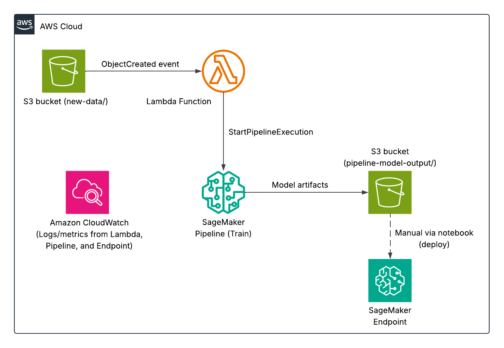
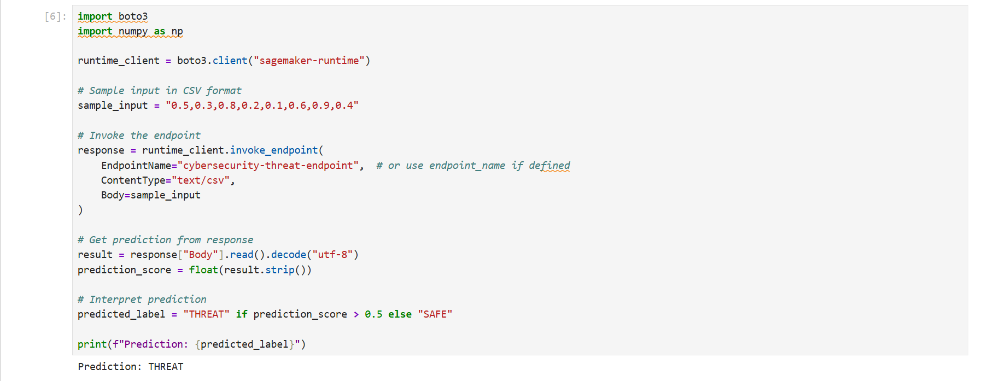

# AWS SageMaker Threat Detection System
This project delivers an end-to-end **Cybersecurity Threat Detection** workflow on AWS. It ingests network traffic, engineers features, trains an **XGBoost** classifier in **Amazon SageMaker**, and can (optionally) serve real-time predictions behind a **SageMaker Endpoint**. A lightweight **SageMaker Pipeline** coordinates training, while an **S3 → Lambda** trigger automatically starts the pipeline whenever new data lands in a configured S3 prefix. The repo emphasizes **reproducibility and clarity**: **Terraform** provisions the S3 bucket, IAM roles, Lambda function, and S3 event notification; concise **Jupyter notebooks** walk through preprocessing, training/evaluation, deployment, and pipeline automation; and **CloudWatch** surfaces logs and metrics for Lambda, training jobs, and the endpoint to verify the flow end-to-end. The demo uses the public **UNSW-NB15** dataset (no sensitive/PII data) and stores training inputs in S3 in **LibSVM format**. Endpoint deployment is **manual by design** via the deploy notebook to keep the flow explicit and cost-safe.  

## Architecture Overview
  
*Figure 1: Architecture diagram of the SageMaker Threat Detection System.*  

- **Amazon S3** – Stores raw network logs, preprocessed datasets, and model artifacts.  
- **AWS Lambda** – Invoked by **S3 ObjectCreated** events to call `StartPipelineExecution` on the SageMaker Pipeline.  
- **Amazon SageMaker** – Trains the **XGBoost** model, runs the **Pipeline**, and (optionally) hosts a real-time **Endpoint**.  
- **Amazon CloudWatch** – Collects logs/metrics from Lambda, training jobs, and the endpoint.  
- **AWS IAM** – Provides execution roles and policies for SageMaker, S3, and Lambda.  

## Skills Applied
- Designing a minimal **cloud ML architecture** with **S3**, **Lambda**, and **SageMaker Pipelines**.  
- Engineering features and preparing data in **Jupyter notebooks** with **pandas/scikit-learn**.  
- Training and evaluating **XGBoost** for **binary classification** (LibSVM inputs, validation).  
- Deploying a **SageMaker Endpoint** and **invoking** it with sample payloads.  
- Monitoring jobs and endpoints via **Amazon CloudWatch** (logs and metrics).  
- Parameterizing notebooks with **bucket/pipeline variables** to keep the repo portable.  

## Features
- **End-to-end demo** – From raw data to trained model and optional hosted endpoint.  
- **S3-triggered automation** – Upload to `new-data/` **→ Lambda** starts the **SageMaker Pipeline**.  
- **Simple pipeline** – Focused training step outputs **model.tar.gz** to S3.  
- **Manual deployment** – Endpoint updates are **intentional** via the deploy notebook (no hidden automation).  
- **Clear notebooks** – Four notebooks: preprocessing, training/testing, deploy/serve, and pipeline automation.  

## Tech Stack
- **Languages:** Python 3.9  
- **AWS Services:** Amazon S3, AWS Lambda, Amazon SageMaker (Training, Pipelines, Endpoints), Amazon CloudWatch, AWS IAM  
- **IaC Tool:** Terraform  
- **Other Tools:** AWS CLI, Jupyter Notebook  

## Deployment Instructions
> **Note:** All command-line examples use `bash` syntax highlighting to maximize compatibility and readability. If you are using PowerShell or Command Prompt on Windows, the commands remain the same but prompt styles may differ.  

### Terraform
1. Clone this repository.  

2. Edit variables in `terraform.tfvars` and/or `variables.tf` to customize the deployment.  

3. Navigate to the `terraform` folder and deploy:  
   ```bash
   cd terraform
   terraform init
   terraform plan # Optional, but recommended.
   terraform apply
   ```  

    **Security (production)**: This demo uses `AmazonSageMakerFullAccess` for simplicity. In production, use **least-privilege IAM** scoped to your resources, **VPC-only** SageMaker/Endpoint access, **S3/KMS encryption**, and VPC endpoints (S3/CloudWatch/API).  

### Notebook Environment
4. Create a SageMaker Notebook Instance.

    - Name: e.g., `cybersecurity-notebook`
    - Instance type: `ml.t2.medium` (or similar)
    - IAM role: `SageMakerCybersecurityRole`

5. Upload the dataset to S3. This demo uses a public dataset (**UNSW-NB15**). **Do not upload sensitive/PII data.**

    - Source: `src/training_data/UNSW_NB15_training-set.csv`
    - Destination: `s3://<your-bucket>/raw-data/UNSW_NB15_training-set.csv`

6. Run the notebooks in order. Set the variables `bucket`, `bucket_name`, `model_artifact`, and `execution_role` with values generated from the Terraform templates.

    - `00_data_preprocessing.ipynb`  
	    - Reads raw CSV from S3 and explores shape/columns/class balance (`label` is 0/1).  
	    - Drops irrelevant columns (`id`, `attack_cat`) for binary classification.  
	    - **Feature engineering**:  
	  	  - `byte_ratio = sbytes / (dbytes + 1)` (avoid div/0)  
		    - `is_common_port` = {80,443,22}  
		    - `flow_intensity `= (spkts + dpkts) / (dur + 1e-6)  
	    - One-hot-encodes **categorical** features (`proto`, `service`, `state`) and converts booleans to integers.  
	    - (Scaling is optional for XGBoost; repo keeps it simple.)  
	    - Saves `preprocessed_data.csv` locally and uploads to S3.  
    - `10_training_and_testing.ipynb`  
	    - Loads preprocessed data, splits into **train/test**, saves `train.csv`/`test.csv`.  
	    - Converts train/test to **LibSVM** (`train.libsvm`, `test.libsvm`) and uploads to S3.  
	    - Configures **XGBoost** estimator (image URI, instance type, output path, hyperparameters).  
	    - Trains on SageMaker using `content_type="text/libsvm"` for both channels.  
	    -  Installs XGBoost locally, trains/evaluates with identical parameters (accuracy & classification report).  
    - `20_deploy_and_serve.ipynb`  
	    - Creates a **SageMaker Model** from the training artifact (`model.tar.gz`).  
	    - *(Optional)* Deploys a **real-time endpoint** for inference.  
	    - *(Optional)* Invokes the endpoint with a sample row and prints **THREAT/SAFE** based on score.  
    - `30_automating_pipelines.ipynb`  
	    - Defines a minimal **SageMaker Pipeline** with a training step (LibSVM inputs).  
	    - Starts an execution and shows status.  

**Note:** Ensure the AWS CLI is configured (`aws configure`) with credentials that have sufficient permissions to manage **S3**, **Lambda**, and **IAM resources**.  
	
## How to Use
1. **Deploy the infrastructure** using Terraform.  

2. **Run notebooks** in order (preprocess → train/test → deploy/serve → pipeline).  

3. **Trigger automation**: upload any file to `s3://<your-bucket>/<your-prefix>/new-data/` to start the pipeline via Lambda.  

4. **Monitor** CloudWatch logs/metrics for Lambda, training jobs, and (if used) the SageMaker endpoint.  

5. ***(Optional)* Deploy the endpoint** to test real-time predictions.  

## Project Structure
```plaintext
aws-sagemaker-threat-detection-system
├── assets/                               # Images, diagrams, screenshots
│   ├── architecture-diagram.png          # Project architecture diagram
│   └── application-screenshot.png        # Endpoint invoke test
├── terraform/                            # Terraform templates
│   ├── main.tf                           # Main Terraform config
│   ├── variables.tf                      # Input variables
│   ├── outputs.tf                        # Exported values
│   ├── terraform.tfvars                  # Default variable values
│   ├── providers.tf                      # AWS provider definition
│   └── versions.tf                       # Terraform version constraint
├── notebooks/                            # Jupyter notebooks
│   ├── 00_data_preprocessing.ipynb
│   ├── 10_training_and_testing.ipynb
│   ├── 20_deploy_and_serve.ipynb
│   └── 30_automating_pipelines.ipynb
├── src/                                  # Lambda source code and sample data
│   ├── training_data/                    # Sample training data
│   │   └── UNSW_NB15_training-set.csv
│   └── triggerpipeline_function/         # Lambda source code
│       └── triggerpipeline_lambda.py
├── LICENSE
├── README.md
└── .gitignore
```

## Screenshot
  

*Figure 2: Endpoint Invoke Test of the SageMaker XGBoost Model.*  

## Future Enhancements
- **Register Model & Automate Endpoint Update** – Add **RegisterModel** and **UpdateEndpoint** steps to the Pipeline.
- **Model Monitor** – Use **SageMaker Model Monitor** for data/label drift and quality baselining.
- **Explainability** – Integrate **SageMaker Clarify** for feature attributions and bias checks.
- **Feature Store** – Persist engineered features in **SageMaker Feature Store** for reuse and consistency.
- **Blue/Green Deployments** – Use production variants and weighted traffic shifting for safe rollouts.
- **Private Networking** – Run jobs/endpoints in a **VPC**, restrict S3 via **VPC Endpoints**, and use **SSE-KMS** encryption.
- **CI/CD** – Add **GitHub Actions** (Terraform lint/validate/plan/apply; **notebook execution tests**).
- **Data Versioning** – Track datasets with **DVC** or S3 **versioned prefixes** (with manifests).
- **Alarms & SLOs** – CloudWatch alarms on training failure, endpoint 4xx/5xx errors, latency, and drift metrics.
- **Autoscaling & Cost Controls** – Endpoint auto-scaling policies; scheduled scaling/off-hours shutdown.

## License
This project is licensed under the [MIT License](LICENSE).  

---

## Author
**Patrick Heese**  
Cloud Administrator | Aspiring Cloud Engineer/Architect  
[LinkedIn Profile](https://www.linkedin.com/in/patrick-heese/) | [GitHub Profile](https://github.com/patrick-heese)  

## Acknowledgments
This project was inspired by a course from [techwithlucy](https://github.com/techwithlucy).  
The Lambda function and notebook commands are taken directly from the author's original implementation. Variables added for portability.  
The architecture diagram included here is my own version, adapted from the original course diagram.  
I designed and developed all Infrastructure-as-Code (Terraform) and project documentation.  
